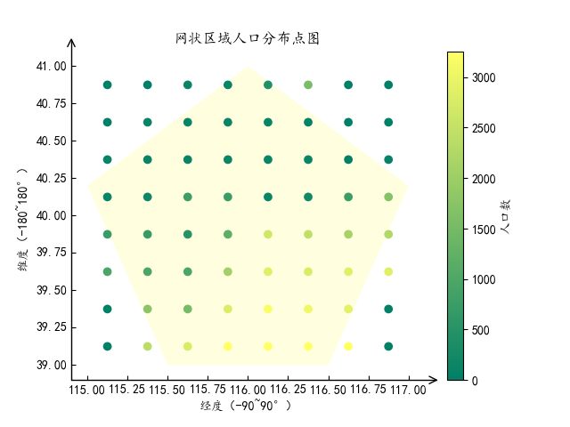

# Python 程序设计-大作业

## 作业题目

### 数据

gpw-v4-population-count-rev11_2020_30_sec_asc.zip 是一个全球人口分布数据压缩文件，解压后包括了 8 个主要的 asc 后缀文件，他们是全球网格化的人口分布数据文件，这些文件分别是：

- gpw-v4-population-count-rev11_2020_30_sec_1.asc
- gpw-v4-population-count-rev11_2020_30_sec_2.asc
- gpw-v4-population-count-rev11_2020_30_sec_3.asc
- gpw-v4-population-count-rev11_2020_30_sec_4.asc
- gpw-v4-population-count-rev11_2020_30_sec_5.asc
- gpw-v4-population-count-rev11_2020_30_sec_6.asc
- gpw-v4-population-count-rev11_2020_30_sec_7.asc
- gpw-v4-population-count-rev11_2020_30_sec_8.asc

这些文件分布对应地球不同经纬度的范围。

压缩文件下载网页：https://sedac.ciesin.columbia.edu/data/set/gpw-v4-population-count-rev11/data-download

### 服务端

压缩文件（gpw-v4-population-count-rev11_2020_30_sec_asc.zip）是一个全球人口分布数据。基于 Sanic 实现一个查询服务，服务包括：

- 按给定的经纬度范围查询人口总数，查询结果采用 JSON 格式。
- 不可以采用数据库，只允许使用文件方式存储数据。
- 可以对现有数据进行整理以便加快查询速度，尽量提高查询速度。

查询参数格式 采用 GeoJSON（https://geojson.org/）的多边形（每次只需要查询一个多边形范围，只需要支持凸多边形）

### 客户端

针对上面的查询服务，实现一个服务查询客户端，数据获取后使用 Matplotlib 散点图（Scatter）进行绘制。

- 横坐标（x 轴）为经度。
- 纵坐标（y 轴）为维度。

## 服务端代码

程序源代码嵌入下方的 code block 中。

```python
from numpy.lib.shape_base import column_stack
from sanic import Sanic
from sanic import response
from sanic.views import HTTPMethodView
from shapely import geometry

import re
import os
import json
import struct
import numpy as np

app = Sanic("GPW-App")

SIZE = 30
COUNT = 360
RANGE = 10800

# 0.00833333 * SIZE
CELL = 0.25


class Factory():
    def __init__(self):
        self.dir = os.path.dirname(os.path.abspath(__file__))
        self.srcPath = self.dir + "./data/gpw_v4_population_count_rev11_2020_30_sec_{}.asc"
        self.dstPath = self.dir + "./data/gpw.bin"

    def preProcess(self):
        if not os.path.exists(self.dstPath):
            for i in range(1, 9):
                self.merge(i)

    # ascii to binary
    def merge(self, num):
        dst = open(self.dstPath, "ab")
        src = open(self.srcPath.format(num), 'r')
        data = [0] * COUNT
        row = 0
        for line in src:
            print(f"row:{row}")

            if row >= 6:
                lineArr = re.split("\s+", line)
                col = 0
                for i in range(0, RANGE):
                    tmp = float(lineArr[i])
                    if tmp != -9999:
                        data[int(col/SIZE)] += tmp
                    col += 1

                if (row-6) % SIZE == (SIZE-1):
                    for val in data:
                        tmp = struct.pack('f', val)
                        dst.write(tmp)
                    data = [0] * COUNT
            row += 1
        src.close()

    def point2line(self, x1, y1, x2, y2):
        return [(x1, y1), (x1, y2), (x2, y2), (x2, y1)]

    def calcPopulation(self, lonLats):
        polygon = geometry.Polygon(lonLats)
        lonMin, latMin, lonMax, latMax = polygon.bounds
        cellArea = geometry.Polygon(self.point2line(0, 0, CELL, CELL)).area
        popuTotal = 0
        grids = []

        for lon in np.arange(lonMin, lonMax, CELL):
            for lat in np.arange(latMin, latMax, CELL):
                cellLon1 = lon - lon % CELL
                cellLon2 = cellLon1 + CELL
                cellLat1 = lat - lat % CELL
                cellLat2 = cellLat1 + CELL
                cellPolygon = geometry.Polygon(
                    self.point2line(cellLon1, cellLat1, cellLon2, cellLat2))
                area = cellPolygon.intersection(polygon).area
                if area > 0.0:
                    p = self.getPopulationFromFile(cellLon1, cellLat1)
                    popuTotal += (area/cellArea) * p
                    grids.append({
                        "lon": cellLon1+CELL/2,
                        "lat": cellLat1+CELL/2,
                        "population": p
                    })
                else:
                    grids.append({
                        "lon": cellLon1+CELL/2,
                        "lat": cellLat1+CELL/2,
                        "population": 0
                    })
        return {
            "population": popuTotal,
            "grids": grids
        }

    def getPopulationFromFile(self, lon, lat):
        # no for block 90*90
        no = int((lon+180)/90) % 4
        if lat < 0.0:
            no += 4

        i = (lon % 90)/CELL
        j = (lat % 90)/CELL
        offset = no * COUNT*COUNT + j * COUNT + i
        return self.getData(np.int64(offset))

    def getData(self, offset):
        # offset < 360*360*8
        # fileSize = 360*360*8*4 Byte
        dst = open(self.dstPath, "rb")
        dst.seek(4*offset)
        data = struct.unpack('f', dst.read(4))[0]
        return data


class GPW(HTTPMethodView):
    async def get(self, request):
        return response.text("GET on GPW.")

    async def post(self, request):
        population = []

        geo = request.json["geometry"]
        if geo["type"] == 'Polygon':
            fac = Factory()
            for coordinate in geo["coordinates"]:
                p = fac.calcPopulation(coordinate)
                population.append(p)

        return response.json(population)


app.add_route(GPW.as_view(), "/gpw")


@ app.get("/")
async def index(request):
    return response.text("Hello, Welcome to GPW Search !!!")

if __name__ == "__main__":
    # fac = Factory()
    # p = fac.calcPopulation(fac.point2line(115.07, 39.07, 117.0833, 41.01))
    # print(p)
    app.run(host="127.0.0.1", port=8000, auto_reload=True, debug=True)

```

### 代码说明

#### 路由结构

服务端采用 Sanic 框架来完成路由。

- 127.0.0.1
  - / 根路由接口
  - /gpw 计算人口接口

#### 预处理

数据本身存储在 8 个`.asc`文件中，数据量较大（接近 5GB），因此需要对数据进行预处理，从而在搜索数据时进行加速。

分析：每个文件中数据量约$10800*10800$个，每个空间 Cell 的大小为$0.0083^2$，若一个大小为$1*1$的地图区域，则需要包含约$120*120$次搜索，且这么多个 Cell，因此同样需要损失精度来获取性能上的提升。这里将将 Cell 大小扩大为$0.25*0.25$，边长扩大 30 倍，于是$10800*10800$减少为$360*360$个数据，以浮点数来存储每个数据，占用$4$字节，将各个数据存储为二进制文件后，文件大小骤缩为$360*360*8*4$字节，约$4MB$。

具体实现：按顺序读取每个`asc`文件，读取每行数据，每行 30 个数据相加，每 30 行的数据同样相加，通过`struct.pack`来写入二进制文件。

#### 人口计算

通过 post 请求`/gpw`接口，来传入`GeoJson`格式的多边形数据，服务端来解析多边形数据，获取人口信息。

1. 根据`GeoJson`可以获取多边形的各个顶点，借助`python`的`shapely`模块来创建`Polygon`多边形对象。
2. 获取经纬度的边界值，借助`numpy`，来将该多边形分割为各个 Cell，计算 Cell 和多边形相交的面积。
3. 若相交面积为正，则根据当前的经纬度来获取对应 Cell 的人口数，此处需要计算出对应在二进制文件`gpw.bin`中的偏移量。
4. 将所有相交的区域的人口数累加，同时记录所有的`grid`，将该数据返回。

#### GeoJson

GeoJson 格式例子，针对多边形 Polygon：

```json
{
  "type": "Feature",
  "geometry": {
    "type": "Polygon",
    "coordinates": [
      [
        [115, 40.2],
        [116, 41],
        [117, 40.2],
        [116.5, 39],
        [115.5, 39]
      ]
    ]
  },
  "properties": {
    "name": "Dinagat Islands"
  }
}
```

## 客户端代码

客户端代码嵌入下发的 code block 中。

```python
import requests
import mpl_toolkits.axisartist as axisartist
import matplotlib.pyplot as plt
import matplotlib.colors as pcolors
import matplotlib.cm as pcm
from shapely import geometry
import numpy as np

plt.rcParams['font.sans-serif'] = ['Kaiti']  # 用来正常显示中文标签
plt.rcParams['axes.unicode_minus'] = False


url = "http://127.0.0.1:8000/gpw"

Default = [
    [115, 40.2],
    [116, 41],
    [117, 40.2],
    [116.5, 39],
    [115.5, 39]
]

cs = ["#CFECFC", "#B8CAFF",
      "#8FABFF", "#295FFF",
      "#0029A3", "#00185E"]


def post(polygon=Default):
    data = {
        "type": "Feature",
        "geometry": {
            "type": "Polygon",
            "coordinates": [polygon]
        },
        "properties": {
            "name": "Dinagat Islands"
        }
    }

    response = requests.post(url, json=data)
    result = response.json()[0]
    result["coordinates"] = data["geometry"]["coordinates"][0]
    # print(result)
    return result


def createCanvas():
    # 创建画布
    fig = plt.figure()
    # 使用axisartist.Subplot方法创建一个绘图区对象ax
    ax = axisartist.Subplot(fig, 111)
    # 将绘图区对象添加到画布中
    fig.add_axes(ax)
    # 通过set_axisline_style方法设置绘图区的底部及左侧坐标轴样式
    # "-|>"代表实心箭头："->"代表空心箭头
    ax.axis["bottom"].set_axisline_style("->", size=1.5)
    ax.axis["left"].set_axisline_style("->", size=1.5)
    # 通过set_visible方法设置绘图区的顶部及右侧坐标轴隐藏
    ax.axis["top"].set_visible(False)
    ax.axis["right"].set_visible(False)


def colorMap(population):
    if population < 1:
        return cs[0]
    elif population <= 5:
        return cs[1]
    elif population <= 25:
        return cs[2]
    elif population <= 250:
        return cs[3]
    elif population <= 1000:
        return cs[4]
    else:
        return cs[5]


def draw(data):
    createCanvas()

    plt.title("网状区域人口分布点图")
    plt.xlabel("经度（-90~90°）")
    plt.ylabel("维度（-180~180°）")

    polygon = geometry.Polygon(data["coordinates"])
    x1, y1 = polygon.exterior.xy
    plt.fill(x1, y1, "#ffffe0")

    lons, lats, pops, colors = [], [], [], []
    for grid in data["grids"]:
        lons.append(grid["lon"])
        lats.append(grid["lat"])
        pops.append(grid["population"])
        colors.append(colorMap(grid["population"]))
    x2 = np.array(lons)
    y2 = np.array(lats)
    c = np.array(colors)
    sc = plt.scatter(x2, y2, c=pops, cmap="summer")

    plt.colorbar(sc, label="人口数")

    plt.savefig('./img.png')
    plt.show()


if __name__ == "__main__":
    polygon = []
    print("请按顺时针（逆时针）输入凸多边形的点的经纬度(x,y)：")
    print("每行按逗号分隔两个数值，输入空则结束")
    while True:
        str = input("输入坐标x,y:")
        xy = str.split(",")
        if len(xy) == 2:
            polygon.append([float(xy[0]), float(xy[1])])
        else:
            break
    if len(polygon) == 0:
        polygon = Default
    res = post(polygon)
    draw(res)
```

### 代码说明

#### POST 请求

在客户端中，请求主要通过`requests`来完成，将数据通过`json`参数传输。

```python
response = requests.post(url, (json = data));
```

指示用户输入点的横纵坐标，将其存储为`GeoJson`类型的数据。

#### 绘图

绘图是客户端的一个重点，借助`matplotlib`完成。

绘图包括四部分：

1. scatter 散点图，需要整理点的经度列表，维度列表，颜色指标数列表，颜色映射(cmap)，此处使用`matplotlib`自带的颜色映射类型`summer`。

```python
sc = plt.scatter(x2, y2, (c = pops), (cmap = "summer"));
```

2. 背景多变形图绘制，需要多边形的边界顶点列表，并填充颜色。

```python
plt.fill(x1, y1, "#ffffe0");
```

3. 颜色柱，直接将散点图的结果作为参数来绘制。

```python
plt.colorbar(sc, (label = "人口数"));
```

4. 坐标轴处理，重新创建坐标轴，并加上箭头。

```python
# 创建画布
fig = plt.figure()
# 使用axisartist.Subplot方法创建一个绘图区对象ax
ax = axisartist.Subplot(fig, 111)
# 将绘图区对象添加到画布中
fig.add_axes(ax)
# 通过set_axisline_style方法设置绘图区的底部及左侧坐标轴样式
# "-|>"代表实心箭头："->"代表空心箭头
ax.axis["bottom"].set_axisline_style("->", size=1.5)
ax.axis["left"].set_axisline_style("->", size=1.5)
# 通过set_visible方法设置绘图区的顶部及右侧坐标轴隐藏
ax.axis["top"].set_visible(False)
ax.axis["right"].set_visible(False)
```


